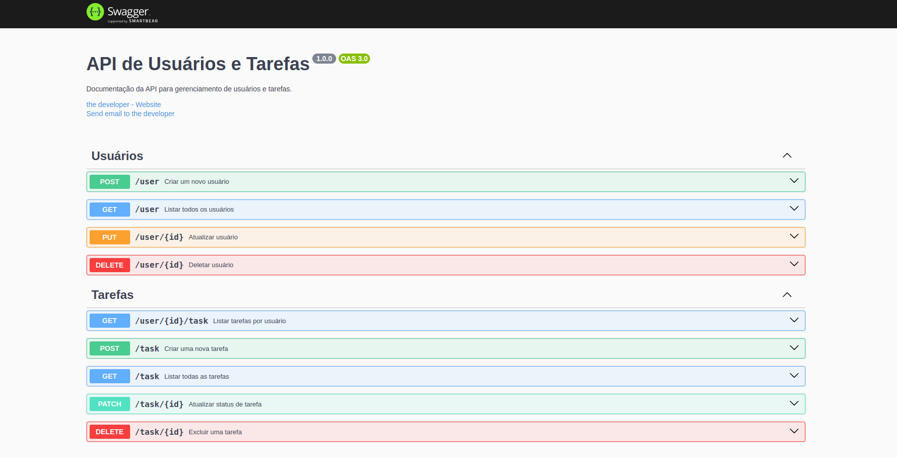

# Desafio Backend



# Descrição

API RESTfull aplicando princípios de SOLID, DDD e TDD.

## Tecnologias

NodeJS, ExpressJS, TypeScript, MongoDb, Mongoose, Swagger, Zod, Jest, Supertest

## Rodando com Docker

- Clonando repositório:

```
git clone git@github.com:DouglasD18/desafio-backend.git
cd desafio-backend
```

- Rodando docker-compose
  ```
  docker-compose up
  ```

## Rodando sem Docker

### Instalando Dependências

```bash
npm install
```

### Rodando Aplicação

- Para rodar o servidor:

  ```
  npm start
  ```

- Para rodar os testes:

  ```
  npm run test
  ```

Rota do swagger da aplicação: http://localhost:3000/api-docs/
